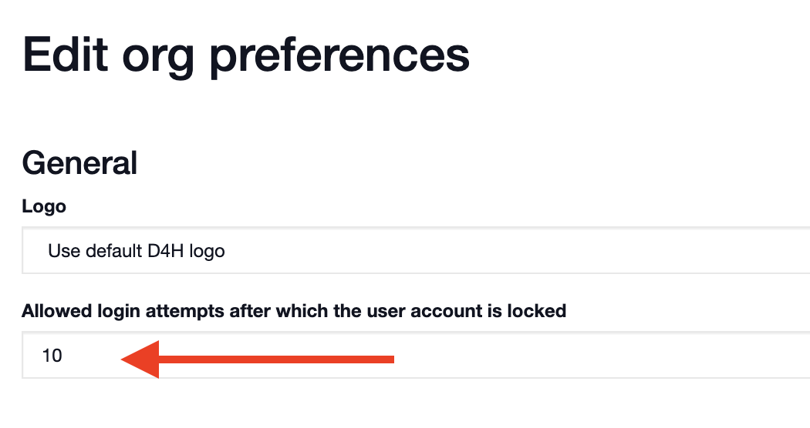

# Unblocking Users

A user will be blocked in [D4H Incident Management](../incident-management/getting-started.md) if they exceed the number of available log in attempts. To unblock a user as an admin: 

* Go to the **Admin Area**
* Select **Collections** 
* Click on **Personnel** 
* Click on the name of the user that is blocked
* Select **unblock user**

To increase or decrease the number of attempts a user can make:

* Go to the **Admin Area**
* Click on **Settings**
* Type a number into the field labeled **'Allowed login attempts after which the user account is locked**'. 

\*\*\*\*

