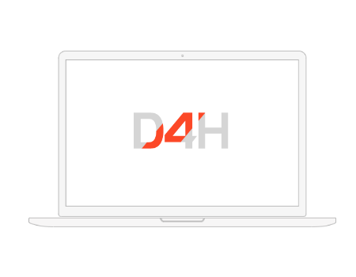

# D4H Quick Start Guide

Once you have received an invite to join D4H, follow the steps below to create your account and get started. The bottom of the guide features a list of ideas for tasks you can complete in D4H once you are logged in.&#x20;

## _Step 1_ - Accept your invite and create an account.

You will receive an invite to join D4H from your organization. If you believe you have been invited but do not see an invite email, check your spam folder.

The email will contain a link to join. Click it and you will be taken to a page to set your username and password. If you already have a D4H account with another organization, you can use the same log in for your new account. If you do chose to create separate accounts, you can always merge them later.&#x20;

## _Step 2_ - Sign-In to D4H in your web browser.

Use your username and password you created to sign-in. If you need additional help, see our guide to [Signing In](signing-in-1.md). Once signed-in, your username may give you access to multiple teams, see our guide to [Switching Teams](switching-teams.md).

## _Step 3_ - Download the mobile apps.

You can download the D4H mobile apps [from the app store](https://d4htechnologies.com/mobile-apps). Our Personnel & Training, Equipment Management, and Incident Management products all have their own apps. Make sure you download the correct app for your needs.

## _Step 4_ - Ideas how you can use your D4H

Depending on the product you are using and the [Permission](../../user-access/permissions/) level you have been granted, you may wish to do different things. Here are some examples of the information you can access and update:

###  Personnel & Training

* View your team [calendar](../../personnel-and-training/calendar/).
* Change your availability in the [on-call planner](../../personnel-and-training/on-call-planner/).
* [Update your profile](../../personnel-and-training/untitled/updating-my-personal-profile.md) on Personnel & Training.
* Add your [calendar to your mobile phone](../../personnel-and-training/calendar/exporting-my-d4h-calendar-to-my-personal-calendar.md).

###  Equipment Management

* Document [repairs](../../equipment-management/repairs/) to equipment.
* Use the [app](../../equipment-management/equipment-management-app/) to track regular [inspections](../../equipment-management/inspections/).
* View the [locations](../../equipment-management/equipment-locations/) of your equipment

###  Incident Management

* View the [Situation](../../incident-management/situation/) Report.
* Post an [update](../../incident-management/updates/) in the log.&#x20;
* Mark a [task](../../incident-management/task-boards/) as complete.
* Fill out a [form](../../incident-management/forms/).

###  Incident Reporting

* Create a new [incident](../../incident-reporting/incident-reports.md).
* Run [reports ](../../shared-services/reports/)on your past incidents.
* Add [persons involved](../../incident-reporting/persons-involved/) to an incident.

